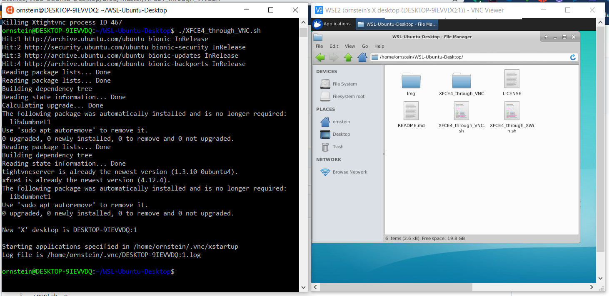
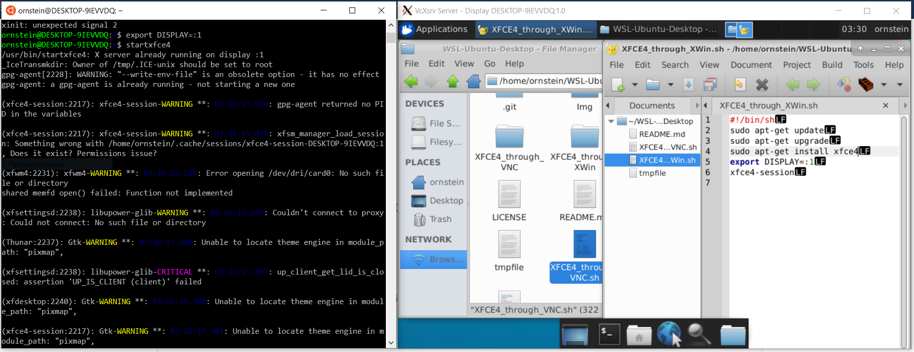

# WSL-Ubuntu-Desktop
Starts desktop on [WSL](https://github.com/microsoft/WSL) Ubuntu (on Windows 10) and setup remote VNC or, alternatively, X Window remote session.

 

Based on following tutorials:
* [How to Install VNC on Ubuntu 18.04 & 16.04 (Windows, Linux and Mac)](https://devanswers.co/install-vnc-ubuntu-18-04-windows-mac-linux/),
* [VNCserver setup on Ubuntu](https://www.scivision.dev/vncserver-setup-on-ubuntu/).

Currently uses lightweight XFCE4 desktop. Requires at least 800Mb of free space on host machine.

To start X Window remote session:
* Install X Window client on Windows 10 host, like [VcXsrv](https://sourceforge.net/projects/vcxsrv/) or some 
other.
* Setup `display number` parameter equal to 1 in X Windows client.
* Start X Windows client session on host Win10.
* Clone this repo to `~/` within WSL.
* Launch `./XFCE4_through_XWin.sh` from repository folder in WSL terminal.

To start VNC session:
* Install some VNC viewer on Windows 10 host, like [RealVNC VNC Viewer](https://www.realvnc.com/en/connect/download/viewer/) or some 
other.
* Clone this repo to `~/` within WSL.
* Launch `./XFCE4_through_VNC.sh` from repository folder in WSL terminal.
* Try to connetc with VNC Viewer on host Win10 to VNC at `localhost:5901` or `127.0.0.1:5901`.
